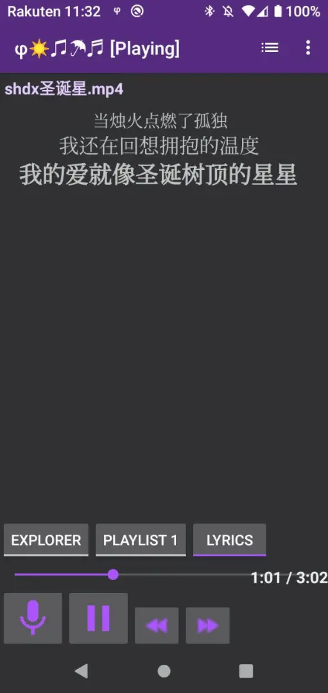

# phiola

phiola *beta* - fast audio player, recorder, converter for Windows, Linux & Android.
It can play audio files from your device or remote server, record audio from your microphone or Internet radio stream, process and convert audio into another format, and more.
Its low CPU consumption conserves the notebook/phone battery.
You can issue commands to phiola via its CLI, TUI, GUI, system pipe and SDK interfaces.
Its fast startup time allows using it from custom scripts on a "play-and-exit" or "record-and-exit" basis.
It's completely portable (all codecs are bundled) - you can run it directly from a read-only flash drive.
It's a free and open-source project, and you can use it as a standalone application or as a library for your own software.

*beta* note: still need to port some stuff from fmedia and re-test everything.

# neoe patches

  ☀♫☂♬

* external .lrc lyrics support

* resume last play position
* other UI customization
## known problem
* seek -10 sec and seek +10 sec not work properly on large audio, which seeking is slow

----------

other info please see https://github.com/stsaz/phiola
